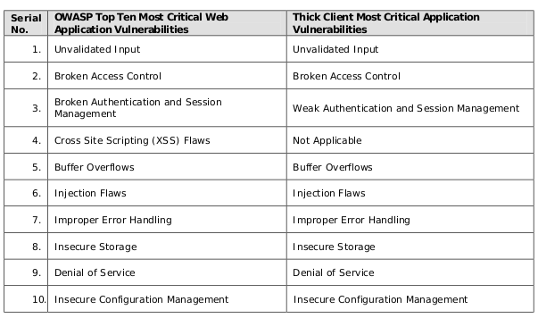

# THREAT MODEL & TEST CASES

### 💀 What is a Threat?

A threat is a potential or actual undesirable event that may be malicious \(such as DOS attack\) or incidental \(failure of a Storage Device\). 

A threat is something which can cause potential harm or it may have the potential to cause harm to the computing environment. Threats vary from viruses, Trojans, backdoor to rootkits.

### 💀 What is a Vulnerability?

### OWASP 

OWASP provides us with list of vulnerabilities, which can be exploited for a thick client

### What is Threat Modeling?

Threat modeling is a planned activity for identifying and assessing application threats and vulnerabilities. Threat modeling improves the security by identifying objectives and vulnerabilities, and then defining countermeasures to prevent, or mitigate the effects of, threats to the system. 

### Sample Threat Model & Test Cases





