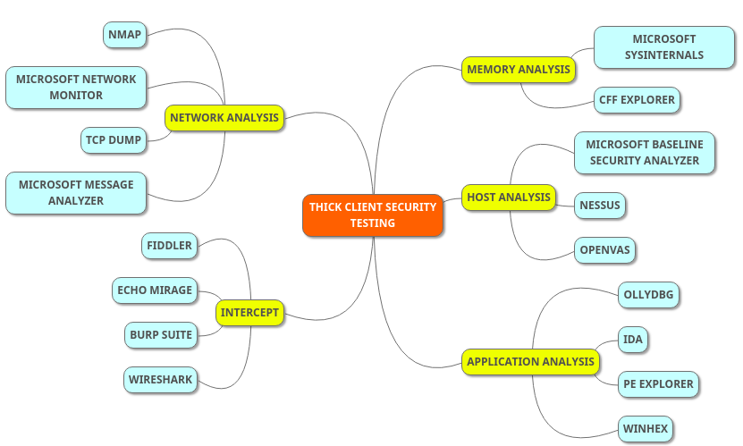

# TOOLS

### ⚓ Reconnaissance 

* Nmap
  * [https://nmap.org/download.html](https://nmap.org/download.html) 
* Nessus
  * [https://www.tenable.com/downloads/nessus](https://www.tenable.com/downloads/nessus) 
* Microsoft Baseline Security Analyzer
  * [https://www.microsoft.com/en-us/download/details.aspx?id=19892](https://www.microsoft.com/en-us/download/details.aspx?id=19892) 
* SignTool
  * [https://docs.microsoft.com/en-us/windows/desktop/seccrypto/signtool](https://docs.microsoft.com/en-us/windows/desktop/seccrypto/signtool) 

###  ⚓Intercepting the Traffic

* Burp Suite 
  * [https://portswigger.net/burp/communitydownload](https://portswigger.net/burp/communitydownload)
* Fiddler
  * [https://www.telerik.com/download/fiddler](https://www.telerik.com/download/fiddler) 
* Wireshark 
  * [https://www.wireshark.org/download.html](https://www.wireshark.org/download.html) 
* Echo Mirage
  * [https://sourceforge.net/projects/echomirage.oldbutgold.p/](https://sourceforge.net/projects/echomirage.oldbutgold.p/) 

### ⚓Traffic Analysis 

* TCP Dump
  * [https://www.microolap.com/products/network/tcpdump/](https://www.microolap.com/products/network/tcpdump/) 
* Wireshark 
  * [https://www.wireshark.org/download.html](https://www.wireshark.org/download.html) 
* Microsoft network monitor
  * [https://www.microsoft.com/en-in/download/details.aspx?id=4865](https://www.microsoft.com/en-in/download/details.aspx?id=4865) 
* MicroSoft Message Analyzer
  * [https://www.microsoft.com/en-in/download/details.aspx?id=44226](https://www.microsoft.com/en-in/download/details.aspx?id=44226)

### ⚓Static Analysis

* CFF explorer 
  * [https://download.cnet.com/CFF-Explorer/3000-2383\_4-10431156.html](https://download.cnet.com/CFF-Explorer/3000-2383_4-10431156.html) 
* Sysinternals
  * [https://docs.microsoft.com/en-us/sysinternals/downloads/procmon](https://docs.microsoft.com/en-us/sysinternals/downloads/procmon) 

### ⚓Reverse Engineering

* OllyDBG
  * [http://www.ollydbg.de/download.htm](http://www.ollydbg.de/download.htm) 
* PE Explorer
  * [http://www.heaventools.com/download-pe-explorer.htm](http://www.heaventools.com/download-pe-explorer.htm) 
* Visual Studio
  * [https://visualstudio.microsoft.com/downloads/](https://visualstudio.microsoft.com/downloads/) 

### ⚓Memory Analysis

* Winhex
  * [https://winhex.en.softonic.com/](https://winhex.en.softonic.com/) 

### ⚓Exploitation 

* Kali linux
  * [https://docs.kali.org/downloading/kali-linux-live-usb-install](https://docs.kali.org/downloading/kali-linux-live-usb-install) 
* Mimikatz
  * [https://sourceforge.net/projects/mimikatz.mirror/](https://sourceforge.net/projects/mimikatz.mirror/) 
* John Ripper 
  * [https://www.techspot.com/downloads/6970-john-the-ripper.html](https://www.techspot.com/downloads/6970-john-the-ripper.html)
* Hexinator 
  * [https://hexinator.com/hexinator-windows/](https://hexinator.com/hexinator-windows/) 

